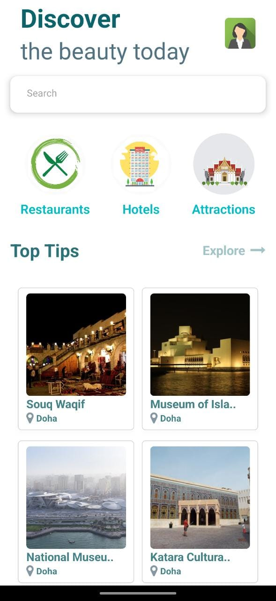
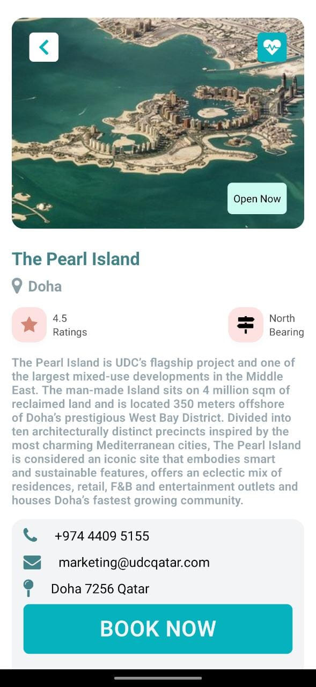

# TRAVELING APP

## Introducción

Se trata de un proyecto donde se utiliza las tecnologias de React Native, Javascript y Tailwind para
el desarrollo de la app, utilizando las APIs Google Places y Rapid .

## Acerca del Proyecto

Este proyecto busca tres tipos de negocio: Hoteles, Atracciones y Restauranes, por todas las partes del mundo

## Objetivos del proyecto

- Manejar peticiones a APIs.
- Prender a leer documentacion de Apis exteriores e implementarlas.
- Manejar respuestas JSON.

## Lista de tecnologías

### Interfaz:

React Native, Tailwind y JavaScript.

## Instrucciones de inicio

## BoilerPlate

### _Instale el paquete necesario para ejecutarlo_

- Abra la consola:
  - Dentro de la carpeta raiz, ejecute la línea de comando,`npm install` / `yarn add`.

### \_Agregar variables de entorno

- Crear un archivo con el nombre `.env` para poder ingresar sus variables de entorno cons sus credenciales:

```
API_KEY_RAPID = "YOUR_API_KEY"
API_KEY_GOOGLE_LOCATION = "YOUR_API_KEY"
```

### _Ejecutar el proyecto_

- Abra la consola :
  - Dentro de la carpeta raiz, ejecute la línea de comando,` npm start` / `yarn start`.

# Pantallas de proyecto

- Home
<p align = "center">  </p>

- Discover
<p align = "center">  </p>

- Detail
<p align = "center">  </p>


